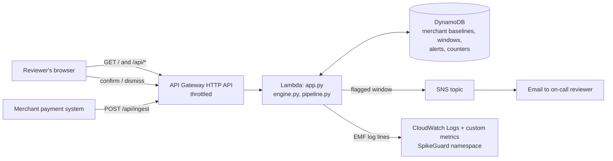

# Architecture

## Request flow for one 5-minute window

1. Payments for one merchant arrive (`/api/ingest`, or `/api/simulate` in the demo).
2. Lambda loads that merchant's state from DynamoDB: the last 48 quiet windows and the regions it has sold to.
3. `engine.py` turns the window into 12 features and z-scores them against the merchant's own median/MAD baseline.
4. Four pattern signatures (card testing, velocity, geographic anomaly, bust-out) turn the z-scores into 0-1 scores. The window score is the strongest one.
5. Score >= threshold (default 0.65) and merchant past its learning period: the window is flagged.
6. Lambda writes the window, the alert and the counters to DynamoDB, publishes to SNS, and logs CloudWatch metrics.
7. A flagged window is **not** added to the baseline, so attacks never teach the detector that fraud is normal.
8. The dashboard polls `/api/summary` every 6 seconds. Reviewer decisions update the alert (conditional write, so a double click cannot double count) and the live precision.

## DynamoDB single-table design

| pk | sk | Holds |
|---|---|---|
| `MERCHANT#<id>` | `STATE` | baseline history, region footprint |
| `WINDOW` | `<epoch>#<merchant>#<id>` | every scored window (TTL 3 days) |
| `ALERT` | `<epoch ms>-<id>` | flagged windows and their review status |
| `STATS` | `TOTAL` | atomic counters (`ADD`) |

## Design choices worth defending

* **Flag, never block.** A false positive costs a reviewer a minute, not a customer a sale.
* **Per-merchant baselines.** A cafe and an electronics shop have completely different normals.
* **Robust statistics (median/MAD).** One bad window cannot drag the baseline.
* **Learning period.** With no history, normal cannot be told from an attack, so the first 6 windows never alert.
* **No third-party Python packages.** Nothing to build or package, so deployment is one `aws cloudformation package`.
